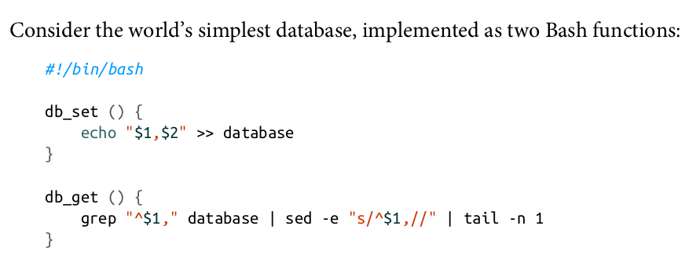
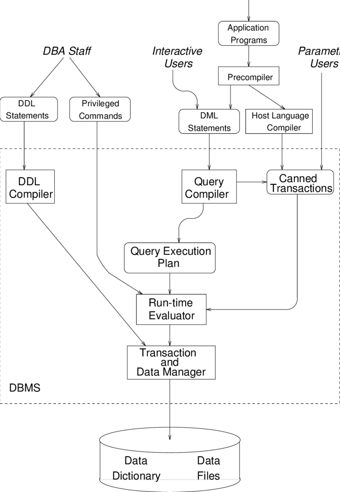
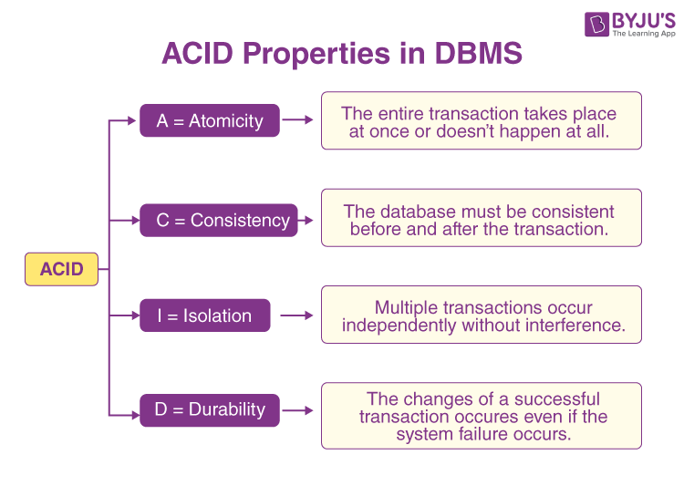
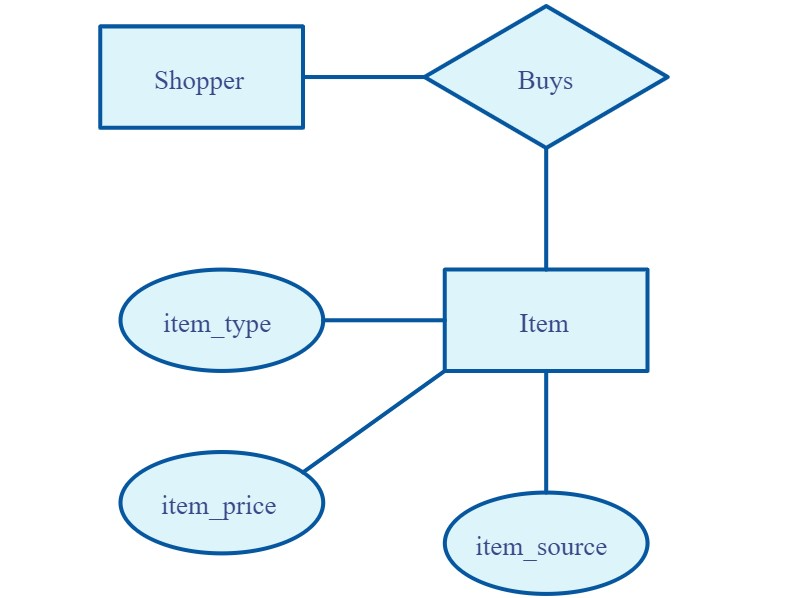
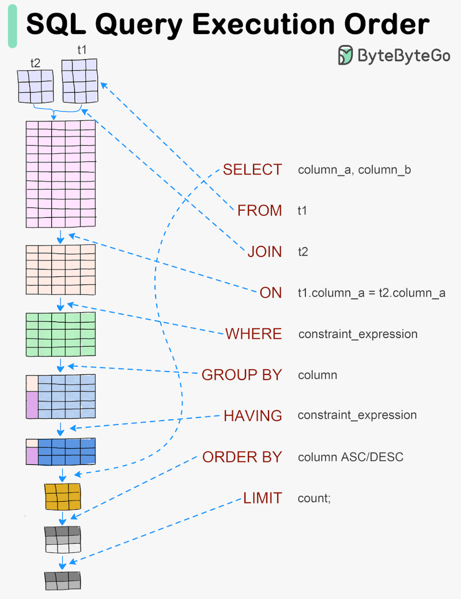

# Databases

# Table of Contents
[0- dataset](#dataset)   
[1- what and why ?](#what&why)   
[2- what is DBMS & their types??](#dbms)   
[3- relational DBMS](#rdbms)   
[4- ACID properties](#acid)   
[5- MYSQL](#mysql)   
[6- database modeling](#model)   
[7- employee example](#employee)   
[8- connect to MySQL](#connect)   
[9- sql tutorial](#sql)   

## Dataset


we have used Employees Sample Database from official mySQL community.   
it's basic database with 6 tables describing employees information, their departments and their titles.   
you can see the database schema on the right.
you can see more about it and how to intall on [github repo](https://github.com/datacharmer/test_db) or [mysql website](https://dev.mysql.com/doc/employee/en/)

<a id="what&why"></a>
## what is a database?
A database is a structured collection of data that is organized and stored in a way that allows for efficient retrieval, management, and manipulation of that data. It serves as a central repository for storing and managing information, making it easier to organize, update, and retrieve data when needed.

## why do we need a database?
we have many business reasons to use database and keep data as:
- Inventory Management
- Sales and Marketing
- Human Resources (HR)
- E-commerce and Online Transactions  
- there asre many other reasons

but why not to use just files or even papers ??
- Data Organization and Storage
- Data Retrieval
- Data Integrity and Accuracy
- Data Security
- Concurrency Control
- there are many other reasons

<a id="dbms"></a>
## what is database managment system (DBMS)?
A Database Management System (DBMS) is software that facilitates the creation, organization, retrieval, and management of data in a database. It acts as an interface between the database and the users or applications, providing tools for defining, querying, and manipulating the data stored in the database. The DBMS ensures data integrity, security, and efficient management of resources.

so it's just a software that writes and reads data but with some rules, you can make your dbms now if you want.   
for example this the simplest database (Desining data intensive applications chapter 2)



## DBMS types
usually we refer to databases as sql or nosql, but unfortunatelly this is not the truth :(    
Take a look [here](https://db-engines.com/en/ranking) you can find that there is more than 15 databases types and more than 400 databases in the current time, too many right ?

each of these databases is designed to handle specific data models and use cases.   

we will mention here some common types:   
1- Relational dbms (sql database)   
2- Document Stores   
3- Column-Family Stores   
4- Graph DBMS   
5- in-memory DBMS   

<a id="rdbms"></a>
## Relational DBMS
A Relational Database Management System (RDBMS) is a type of database management system that organizes data into tables, which consist of rows and columns.   
what is relational algebra ??    
Edgar F. Codd introduced the relational model in his seminal paper titled "A Relational Model of Data for Large Shared Data Banks," published in 1970, the implementation of this paper was IBM's System R.   
The first commercially available RDBMS was Oracle, which was released in 1979 by Larry Ellison, Bob Miner, and Ed Oates.   
   
**key components**   
1- Tables   
2- Rows and Records   
3- Columns and Attributes   
4- Keys   
5- Relationships   

<a id="acid"></a>
## ACID properties



Properties that guarantee the reliability of transactions in a database:   
1- Atomicity (A)   
2- Consistency (C)   
3- Isolation (I)   
4- Durability (D)   

## MySQL
MySQL is an open-source relational database management system (RDBMS) that uses a structured query language (SQL) to manage, manipulate, and retrieve data.
**Installation**   
- [video for windows 10](https://youtu.be/uj4OYk5nKCg?si=jUWaTOH2JQ-dPhCm)
- [ubuntu 22](https://linuxhint.com/install-mysql-on-ubuntu-22-04/)
- [official website](https://dev.mysql.com/downloads/mysql/)

Just remember the password carefully.

<a id="model"></a>
## database modeling
Database modeling is the process of creating a data model for a database. A data model is a visual or mathematical representation of the data structures and relationships within a database system. The primary goal of database modeling is to define the structure of the database in a way that accurately represents the information that it is intended to store and manage.

**Modeling Steps**

***Requirement Analysis:*** Understand the requirements of the system and identify the data that needs to be stored.

***Conceptual Modeling:*** Create an abstract representation of the data using techniques like Entity-Relationship Diagrams (ERD) to capture the entities and their relationships.



***Logical Modeling:*** Define the logical structure of the database, including tables, columns, and relationships.


***Normalization:*** Optimize the database design by eliminating data redundancy and ensuring data integrity through normalization techniques.

***Physical Modeling:*** Define how the logical model will be implemented in the physical storage of the database, considering factors like indexing, partitioning, and data types.

<a id="employee"></a>
## Employee examples
A CEO of a famous cooperation reached you to design a database sytem for them.   
he needs to save data about the employees in each department and their titles.   
help them mr.databaser :)   

**step1: requirement analysis**   
Ask them about more details (what data about employees you have?, what data about departments you have?)   
Ask more and more till you fully understand what are the requirments ?   

**Step2: ERD**   
let's convert these requirements to ERD.   

**Step3: ERD to relational**   
[nice article](https://medium.com/@kumarjai2466/er-to-relational-mapping-ac84b3c9f258)

**Step4: normalize if needed**
Using the normalization  
[here](https://www.freecodecamp.org/news/database-normalization-1nf-2nf-3nf-table-examples/)

**Step5: actuale db schema**
see [here](./test_db/employees.sql)

<a id="connect"></a>
## connect to mysql

- using mysql cli  
run ```mysql -h <host-name> -P <port> -u <user-name> -p```   
then enter your password
for example: ```mysql -h mysql-162195-0.cloudclusters.net -P 19994 -u test_user -p```
- using workbench   
open workbench and sign in.
- using phpmyadmin   
web based app   
- using python   
install mysql connector ```python3 -m pip install mysql-connector-python```   
see this demo script [here](./db_script.py)   
make sure you define a .env file first 

<a id="sql"></a>
## Fastest sql tutorial
see this crash course (personal recommendation) [here](https://www.youtube.com/watch?v=7S_tz1z_5bA)


- DDL vs DML??   
- [crud operations](https://www.devart.com/dbforge/sql/sqlcomplete/crud-operations-in-sql.html)   

we need to get/insert data from/into the database, that's our main goal.   

<font size="3">***let's take a look about***</font>    
**SELECT:** Specifies the columns to retrieve in a query.

**FROM:** Specifies the table or tables from which to retrieve the data.

**JOIN:** Combines rows from two or more tables based on a related column between them.

**ON:** Specifies the condition for the join, indicating how the tables are related.

**WHERE:** Filters the rows based on a specified condition.

**GROUP BY:** Groups the result set by one or more columns, often used with aggregate functions.

**HAVING:** Filters the grouped rows based on a specified condition, similar to WHERE but for aggregated data.

**ORDER BY:** Sorts the result set based on one or more columns, either in ascending or descending order.

**LIMIT:** Specifies the maximum number of rows to return in the result set.

see examples [here](./examples.sql)   
more examples [here](https://gist.github.com/wgopar/a613fe6152c217f1c6faeca39c2b2c39) and [here](https://github.com/bmonroe44/MySQL-for-BI/blob/master/employee%20database%20queries.sql)
